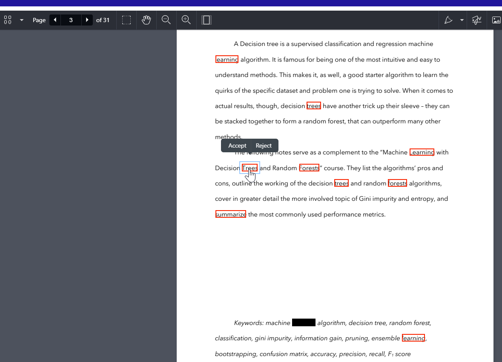

This is a simple sample project built in # React + TypeScript + Vite to mark the text for redactions using PSPDFKit Web SDK and then click on the marked Redation Annotations and review it, which pops over two buttons to accept or reject. click on it and accept to redact or on reject to removed it from redaction. 

1. Open a terminal and navigate to the project directory.
2. Run npm i to install the project dependencies.
3. Copy the PSPDFKit for Web library assets to the public directory by running: cp -R ./node_modules/pspdfkit/dist/pspdfkit-lib public/pspdfkit-lib
4. You should now be able to run the project locally by executing npm run dev

